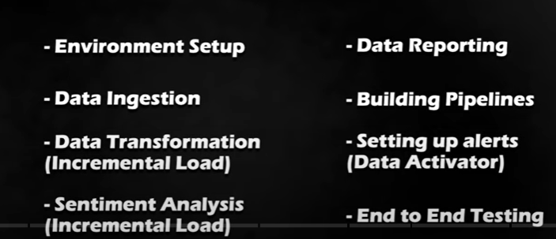
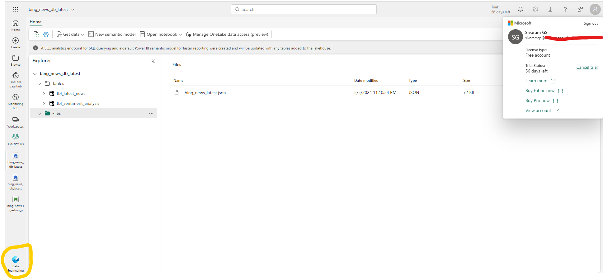
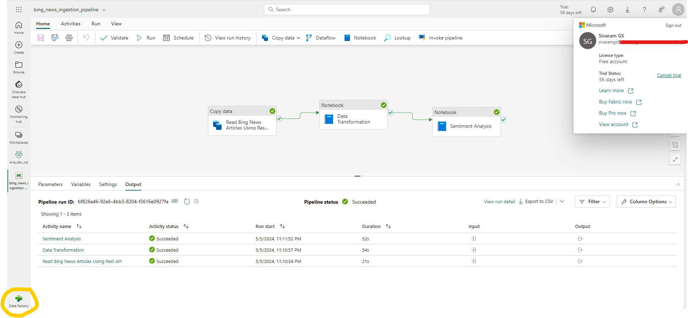
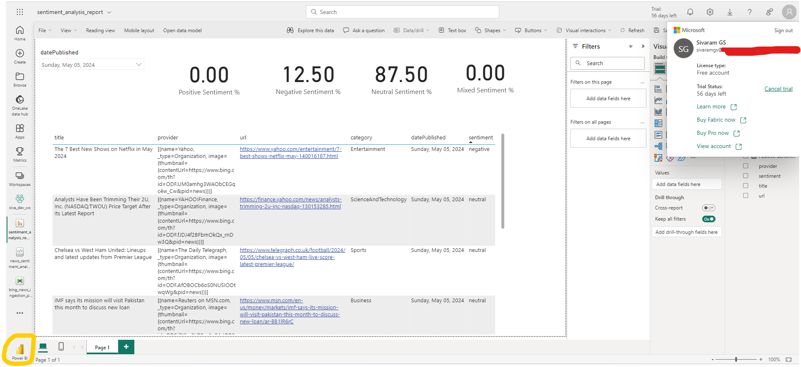
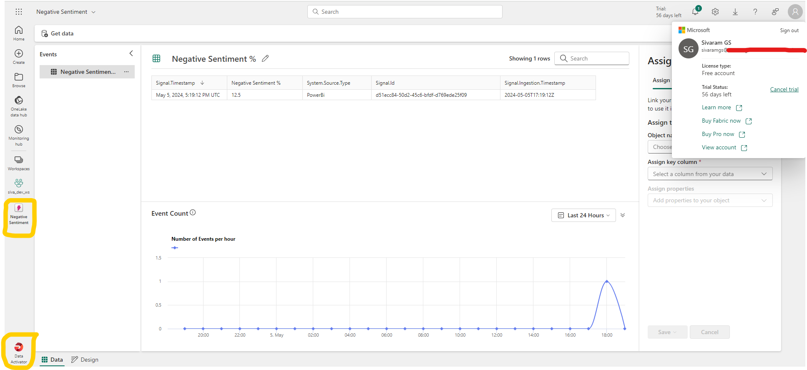
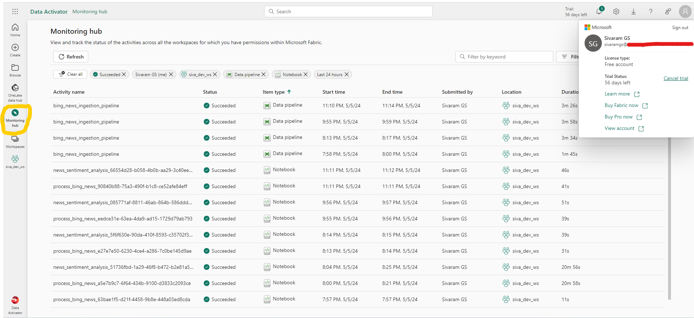
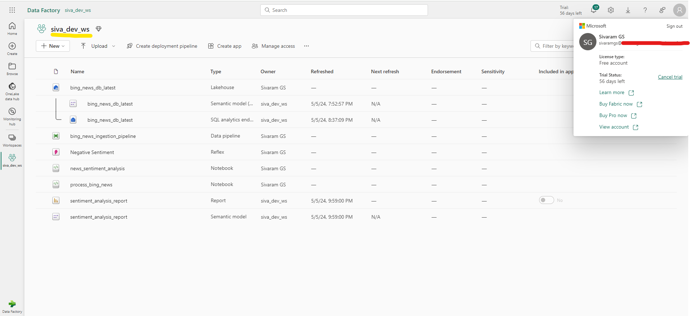

# Project
To build a Bing News Data Analytics platform in Azure Data Engineering using Microsoft Fabric.Pull raw data from Bing API, transform the raw data to clean data with Synapse Data Engineering, analyze sentiment with Synapse Data Science, set up workflows with Data Factory, make cool reports with Power BI, set alerts with Data Activator, and test the pipeline.

# High Level Requirements:
### 

# Project Architecture
### 

# Tech Stack:
- Copy Data Using Data Factory (Fabric)
- Synapse Data Engineering (Fabric)
- Spark Notebook (Fabric)
- Synapse Data Science (Fabric)
- Power BI (Fabric)
- Pipelines using Data Factory (Fabric)
- Alerts using Data Activator (Fabric)

# Work Done:
## Created Azure Resource Group
- Created the required resources under single resource group: Bing News APi and Fabric Capacity.
### 

## ETL Process
- Ingested data from Bing V7 Rest API using Data Factory copydata activity.
- Transformated data using Synapse Data Engineering: Refined the raw JSON data to a curated Delta Table ('tbl_latest_news'), including techniques like incremental loading (Type 1 SQL Merge) to keep the processes efficient.
- Done Sentiment Analysis using Synapse Data Science: Uncovered insights hidden within the news description by predicting the sentiment of the news classified as Positive, Negative, Neutral or Mixed. Stored the results as a separate column 'sentiment' in a new delta table 'tbl_sentiment_analysis'
### 

## Configured Data Factory Pipelines
### 

- Orchestrated the data workflows using Data Factory via pipelines to ensure smooth and efficient operations.

## Created PowerBi Interactive Dashboard with DAX Query using custom semantic model
- Data Reporting using Power BI: Visualized the data in a compelling and actionable manner, empowering stakeholders with valuable insights.
### 

## Created Custom Alerts
- Configured alerts and notifications within the Power BI visuals using Data Activator Reflex.
### 

## End to End Pipeline Testing
- The complete flow tested right from the data ingestion to the data transformation and until the report gets updated with the incoming new data to Validate the integrity and performance of the pipelines, ensuring reliability and accuracy.
- Review the different pipeline run results in Monitoring Hub.
### 

## Different resources created under the workspace
### 
    
