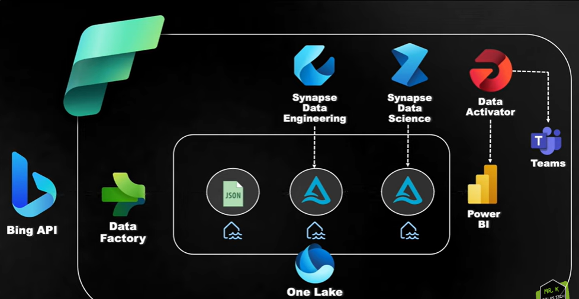
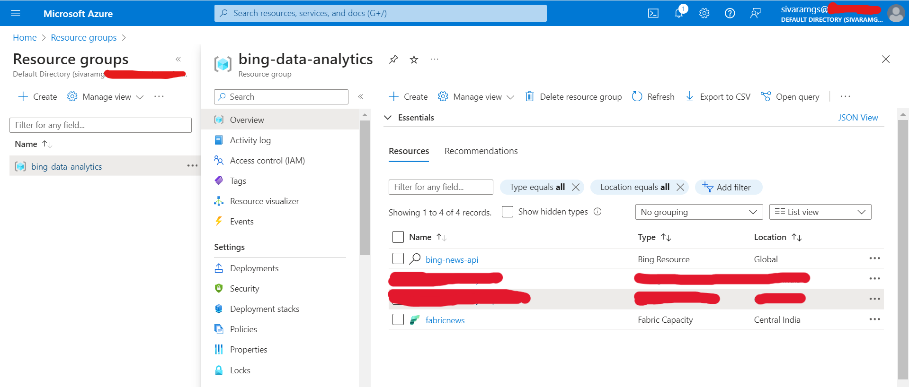

# Project
To build a Bing News Data Analytics platform in Azure Data Engineering using Microsoft Fabric.Pull raw data from Bing API, transform the raw data to clean data with Synapse Data Engineering, analyze sentiment with Synapse Data Science, set up workflows with Data Factory, make cool reports with Power BI, set alerts with Data Activator, and test the pipeline.

# High Level Requirements:
1. Data Ingestion from Bing API using Data Factory.
2. Data Transformation using Synapse Data Engineering: Refine the raw JSON data to a curated Delta Table, including techniques like incremental loading to keep the processes efficient.
3. Sentiment Analysis using Synapse Data Science: Uncover insights hidden within the news description by predicting the sentiment of the news classified as Positive, Negative, Neutral or Mixed.
4. Orchestrate the data workflows using Data Factory via pipelines to ensure smooth and efficient operations.
5. Data Reporting using Power BI: Visualize the data in a compelling and actionable manner, empowering stakeholders with valuable insights.
6. Configuring Alerts using the Data Activator: Stay ahead of potential issues by setting up alerts and notifications within the Power BI visuals using Data Activator.
7. End to End Pipeline Testing: The complete flow will be tested right from the data ingestion to the data transformation and until the report gets updated with the incoming new data to Validate the integrity and performance of the pipelines, ensuring reliability and accuracy.

# Project Architecture
### 

# Tech Stack:
- Copy Data Using Data Factory (Fabric)
- Synapse Data Engineering (Fabric)
- Spark Notebook (Fabric)
- Synapse Data Science (Fabric)
- Power BI (Fabric)
- Pipelines using Data Factory (Fabric)
- Alerts using Data Activator (Fabric)

# Work Done:
## Created Azure Resource Group
- Created the required resources under single resource group: Bing News APi and Fabric Capacity.
### 
